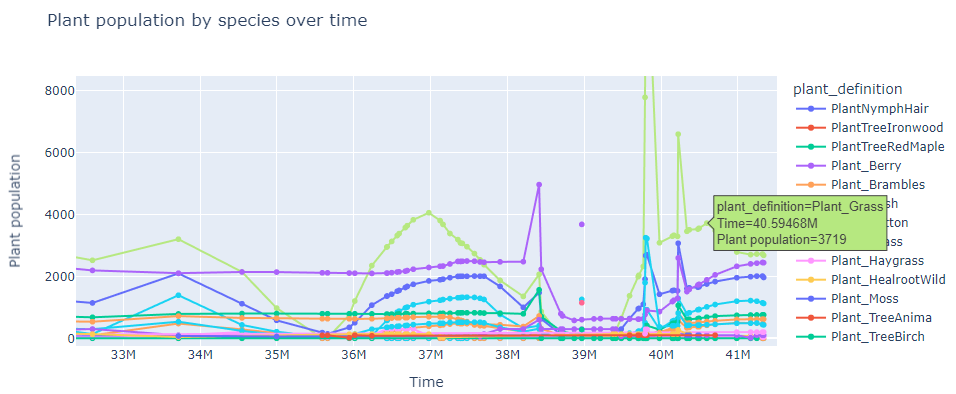

# Changelog

## [0.6.0](https://github.com/stone-tech-inc/rimhistory/tree/v0.6.0) (2022-02-24)

### New features

* Load files asynchronously to reduce runtime ([#16][i16])
* Support gzip-compressed save files (.gz extension)

### Improvements

* Bump `coverage` from 6.3.1 to 6.3.2 ([#19][p19])
* Remove functions and tests related to XML element removal, which can be spun off into a save file size reduction tool if desired
* Remove obsolete, custom ignore rules from `.gitignore`

### Testing

* Move the test-related config data from `config.json` to pytest fixtures to simplify the project structure
* Replace the single save file with a series of compressed save files to test the `SaveSeries` class and the time-series analysis features
* Modify the GitHub Actions workflow to run the pytest test cases asynchronously first, halting on the first error, allowing for quicker feedback in the case of a problem
* Update test cases to reflect changes to test input data, test configuration, and the usage of the new pytest fixtures

[i16]: https://github.com/stone-tech-inc/rimhistory/issues/16
[p19]: https://github.com/stone-tech-inc/rimhistory/pull/19

## [0.5.0](https://github.com/stone-tech-inc/rimhistory/tree/v0.5.0) (2022-02-15)

### New features

* Use data from a series of save files to produce time-series datasets and visualizations
* Each dataset is extracted from a series of save files and stored in pandas DataFrames internally
* The in-game time is extracted from each save file and added to the data model for use as a time dimension
* Null handling logic passes a `None` value into the pandas DataFrame when data is missing, such as missing plant age, pawn ambient temperature, or pawn first name

### Improvements

* Reduce memory usage by deleting the XML root element as soon as possible after instantiating a Save object
* Bump `pandas` to 1.4.1
* Bump `pytest` to 7.0.1
* Configure `flake8` errors to halt the GitHub Actions build process
* Clean up code style issues raised by `flake8`

### Notes

Example chart generated from 167 save files:  


Performance for large file sets:  
During testing, the latest version was able to process 167 sequential save files in 124 seconds. This allows users with a large number of saves to load them all without too long of a wait. This could be sped up further by refactoring the SaveSeries class to initialize its Save objects asynchronously.

## [0.4.0](https://github.com/stone-tech-inc/rimhistory/tree/v0.4.0) (2022-02-11)

### Improvements

* Implement a `Save` class with a namespace for accessing key data points and datasets

```text
Save.data
├───datasets
│   ├───mod
│   │   ├───dataframe
│   │   └───dictionary_list
│   ├───pawn
│   │   ├───dataframe
│   │   └───dictionary_list
│   ├───plant
│   │   ├───dataframe
│   │   └───dictionary_list
│   └───weather
│       ├───dataframe
│       └───dictionary_list
├───file_size
├───game_version
├───path
└───root
```

* The pandas DataFrame containing plant information for the save file can be accessed through `Save.data.datasets.plant.dataframe`. The namespace is created using `bunch`.
* Consolidate all functions related to loading or modifying save data in the `Save` class
* Bump `plotly` to 5.6.0

## [0.3.0](https://github.com/stone-tech-inc/rimhistory/tree/v0.3.0) (2022-02-09)

### New features

* Count of every living plant species
* Distribution chart that visualizes the current growth progress of living plants
* Pawn environment ambient temperature
* Current weather conditions

### Improvements

* Configure `dependabot` alerts
* Use the `tmp_path` pytest fixture for test data storage, allowing parallel processing of test cases with file I/O

## [0.2.0](https://github.com/stone-tech-inc/rimhistory/tree/v0.2.0) (2022-02-05)

### New features

* HTML report with summary information:
  * Game version
  * Save file size
  * List of installed mods
  * Pawn information
  * Flora presence and growth statistics

### Testing

* Use `coverage` to measure the code coverage during pytest execution and require 100% code coverage ([coverage documentation](https://coverage.readthedocs.io/en/6.3.1/))
* Add test cases to increase overall test coverage from 48% (v0.1.0) to 100% (v0.2.0)

## [0.1.0](https://github.com/stone-tech-inc/rimhistory/tree/v0.1.0) (2022-02-02)

### New features

* Python-based ELT solution that extracts meaningful information from XML data as structured data that can be easily turned into reports, visualizations, and metrics
